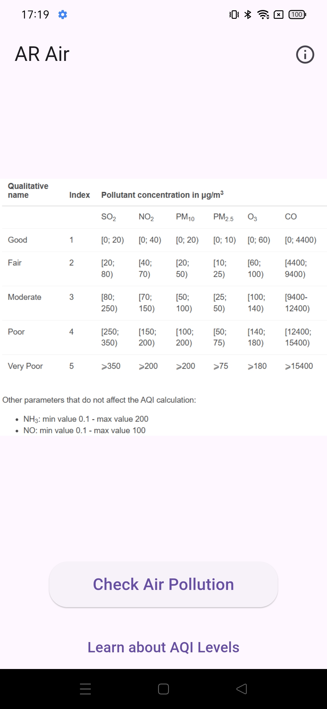
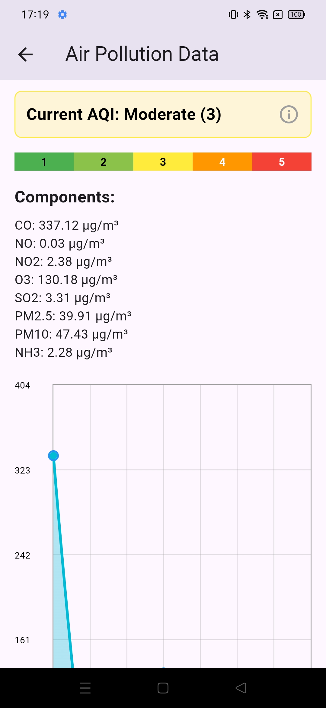
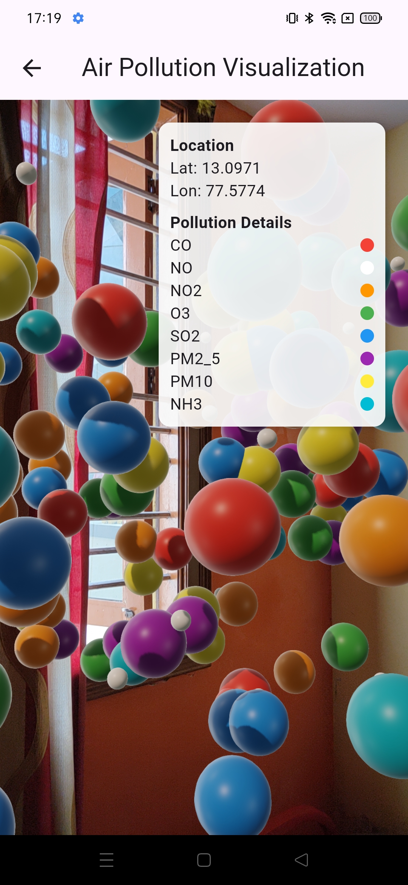

# Enhancing Air Pollution Visualization in Augmented Reality Using Adaptive Level of Detail


## Getting Started

One of the most important environmental 
problems in the world is air pollution, which calls for efficient 
monitoring and communication systems. Through the use of 
Augmented Reality (AR), this project seeks to improve the 
visualization of air pollution statistics while providing a user-
friendly and interactive method of raising environmental 
awareness. LOD algorithms are essential for achieving 
scalable, immersive, and real-time visualization. Optimizing 
the LOD technique for the effective depiction of extensive air 
pollution datasets in augmented reality environments is the 
main goal of this project. The goal of this project is to integrate 
AR platforms with real-time air quality data so that users may 
see the different degrees of pollution in their environment. By 
simplifying or eliminating less crucial information to lessen 
the computational burden and boost efficiency, the LOD 
algorithm can be optimized to display data points with higher 
relevance more accurately. Adjusting data granularity levels
according to user proximity, viewpoint, and device capability 
will be part of the optimization process. The research will 
improve scalability and provide smoother interactions across 
many platforms, including AR headsets and smartphones, by 
increasing the algorithm’s efficiency. In the end, this 
approach will make it possible to track air pollution in a more 
accessible and insightful manner, which may inspire 
preventive steps for public health and environmental 
protection.
This project is a starting point for a Flutter application.

A few resources to get you started if this is your first Flutter project:

- [Lab: Write your first Flutter app](https://docs.flutter.dev/get-started/codelab)
- [Cookbook: Useful Flutter samples](https://docs.flutter.dev/cookbook)

For help getting started with Flutter development, view the
[online documentation](https://docs.flutter.dev/), which offers tutorials,
samples, guidance on mobile development, and a full API reference.


Here's a comprehensive **README.md** for your **Air Pollution Tracker** GitHub repository:

---

# 🌍 Air Pollution Tracker

A Flutter application that monitors real-time air quality data, displays AQI levels, and provides detailed pollutant information with an interactive AR experience.


## ✨ Features

- **Real-time Air Quality Data** - Fetches and displays current pollution levels
- **AQI Visualization** - Color-coded AQI scale (1-5) with qualitative indicators
- **Pollutant Breakdown** - Detailed concentration levels for:
  - SO₂, NO₂, PM₁₀, PM₂.₅, O₃, and CO
- **Interactive Charts** - Visualize pollutant data with dynamic line charts
- **Augmented Reality** - AR view to visualize air quality in your environment
- **Educational Content** - Complete AQI reference guide with health implications

## 📊 AQI Reference Table

| Level | Index | Quality    | Color  | Health Implications              |
|-------|-------|------------|--------|-----------------------------------|
| 1     | 0-50  | Good       | 🟢 Green | Air quality is satisfactory       |
| 2     | 51-100| Fair       | 🟢 Light Green | Acceptable quality               |
| 3     | 101-150| Moderate  | 🟡 Yellow | Sensitive groups affected         |
| 4     | 151-200| Poor      | 🟠 Orange | Health effects for everyone       |
| 5     | 201-300| Very Poor | 🔴 Red | Health warnings of emergency conditions |

## 🛠️ Installation

1. **Clone the repository**
   ```bash
   git clone https://github.com/yourusername/air-pollution-tracker.git
   cd air-pollution-tracker
   ```

2. **Install dependencies**
   ```bash
   flutter pub get
   ```

3. **Run the app**
   ```bash
   flutter run
   ```

## 📱 Screens

| Home Screen | AQI Dashboard | AR View |
|-------------|---------------|---------|
|  |  |  |

## 🧰 Technologies Used

- **Flutter** - Cross-platform framework
- **GetX** - State management and navigation
- **fl_chart** - Data visualization
- **ARCore/ARKit** - Augmented Reality integration
- **OpenWeatherMap API** - Air quality data source

## 🌐 API Configuration

1. Get your API key from [OpenWeatherMap](https://openweathermap.org/api)
2. Create `.env` file:
   ```env
   OPEN_WEATHER_API_KEY=your_api_key_here
   ```

## 🤝 Contributing

Contributions are welcome! Please follow these steps:
1. Fork the project
2. Create your feature branch (`git checkout -b feature/AmazingFeature`)
3. Commit your changes (`git commit -m 'Add some amazing feature'`)
4. Push to the branch (`git push origin feature/AmazingFeature`)
5. Open a Pull Request

## 📜 License

Distributed under the MIT License. See `LICENSE` for more information.

## 📬 Contact

Utsav Kumar


---

### 🎨 Assets Needed
Replace placeholder images with actual screenshots:
1. `assets/screenshots/app_preview.png`
2. `assets/screenshots/home.png`
3. `assets/screenshots/dashboard.png`
4. `assets/screenshots/ar.png`

